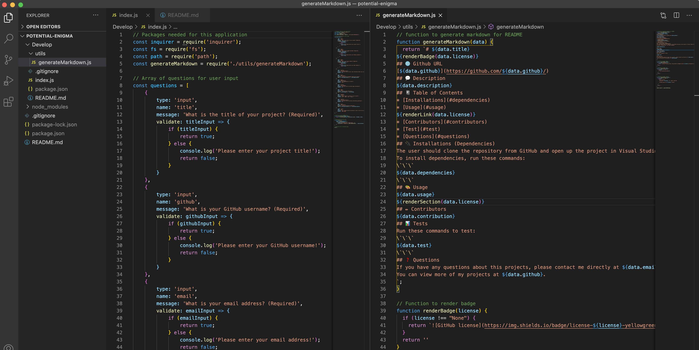
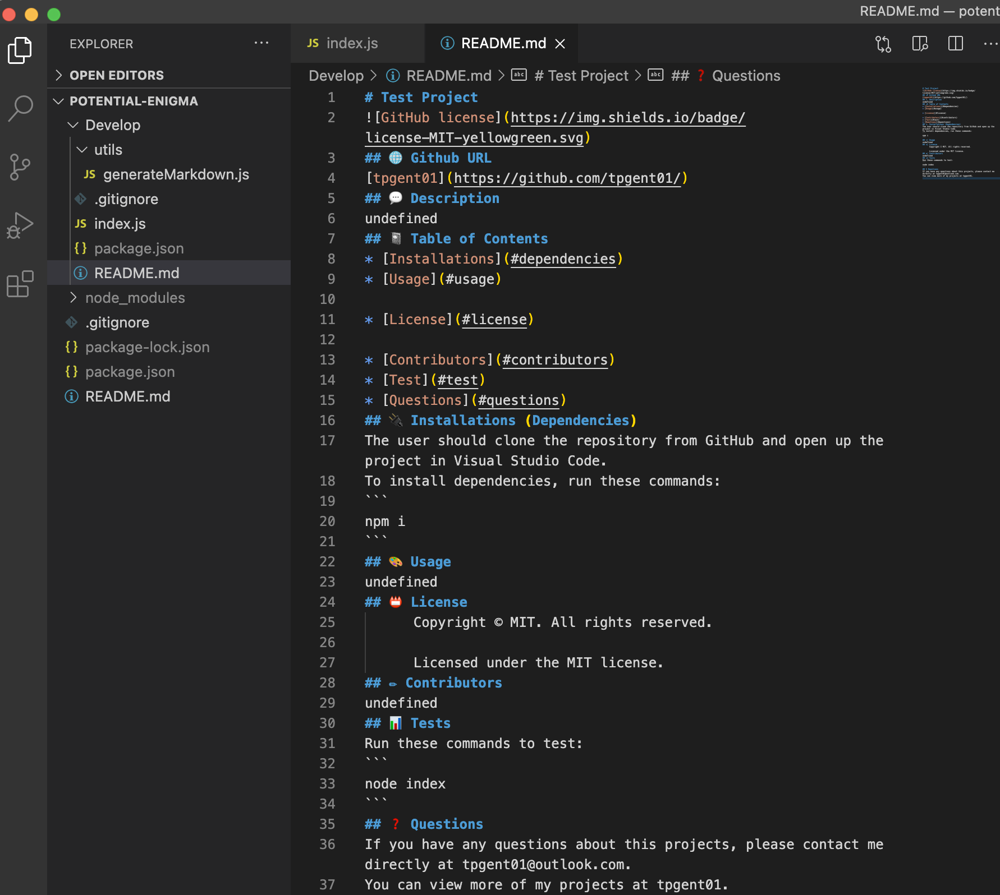

# README Generator


## 💬 Description 

A Node.js based tool where users can generate a README.md file for their repository projects directly in their code editor through prompts in the terminal.


## 📓 Table of Contents

* [User Story] (#user)
* [Installation](#installation)
* [Usage](#usage)
* [Built With](#built)
* [License](#license)
* [Badges](#badges)
* [Contributing](#contributing)
* [Tests](#tests)
* [Questions](#questions)


## 🧠 User Story
```
- AS A developer
- I WANT a README generator
- SO THAT can quickly create a professional README for a new project
```


## 🔌 Installation

The user should clone the repository from GitHub and open up the project in their code editor.


## 🎨 Usage 

* This tool allows users to create a README.md file
* Users are prompted to enter the following:
  - Project Title
  - Email
  - GitHub Username
  - Project Description
  - Usage
  - License
  - Installation & Dependencies
  - Test Commands
  - Contributors

### Screenshots


<br></br>

<br></br>

### Walk Through


## ✏️ Built With

<p><a href="https://nodejs.org/">Node.js</a></p>
<p><a href="https://www.npmjs.com/">NPM</a></p>
<p><a href="https://www.npmjs.com/package/inquirer">Inquirer.js</a></p>


## 🔐 License
```
Copyright © MIT. All rights reserved. 
Licensed under the MIT license.
```


## 🏆 Badges


## 📌 Contributing

Taylor Gentry ©2020 All Rights Reserved.


## 📊 Tests

To test this project, please see the [Installation](#installation) section. Then run command _node index.js_.


## ❓ Questions
If you have any questions about this projects, please contact me directly at tpgent01@outlook.com. 
You can view more of my projects at https://github.com/tpgent01 👾
